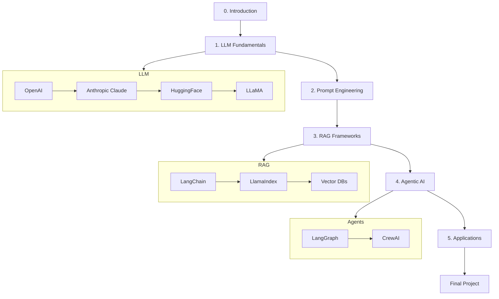

# Generative AI Bootcamp 🚀

Welcome to the **Generative AI Bootcamp**!
This program will take you from fundamentals of LLMs to building full-scale **RAG, Agentic AI, and real-world applications**.

---

## 📚 Syllabus

We’ve structured the course to be **progressive and hands-on**:

* [Detailed Syllabus](./syllabus.md)
* [Syllabus (Table View)](./syllabus-table.md)

---

## 📂 Repository Structure

```bash
genaiboot/
├── 0-intro/                # Setup & environment
├── 1-llm-fundamentals/     # OpenAI, Claude, HuggingFace, LLaMA
├── 2-prompt-engineering/   # Basics & advanced prompting
├── 3-rag-frameworks/       # LangChain, LlamaIndex, Vector DBs
├── 4-agentic-ai/           # LangGraph, CrewAI
├── 5-applications/         # Streamlit, APIs, AWS Bedrock/SageMaker
├── assessments/            # Quizzes & module evaluations
├── final-project/          # Capstone project template
├── reference-materials/    # Extra reading & resources
├── submissions/            # Mentee submissions
├── requirements.txt        # Python dependencies
└── docker-compose.yml      # Optional containerized setup
```

---

## 🛠️ Getting Started

1. **Clone the repo**

   ```bash
   git clone https://github.com/jyotibizp/genaiboot.git
   cd genaiboot
   ```

2. **Set up environment**

   ```bash
   python3 -m venv .venv
   source .venv/bin/activate
   pip install -r requirements.txt
   ```

3. **Explore Intro module**

   ```bash
   cd 0-intro
   ```

---

## 🎯 Learning Flow

1. **Follow lessons** in each module
2. **Complete exercises** (submit in your `submissions/<your_name>/`)
3. **Attempt assessments** after each module
4. **Work on capstone** in `final-project/`

---

## 🗺️ Course Roadmap



---

## 🤝 Contributing

* Trainers can add/update lessons under the relevant module.
* Mentees should **never modify root modules** — only use `submissions/`.

See [CONTRIBUTING.md](./CONTRIBUTING.md).

---

## 🏆 Final Project

At the end of the bootcamp, you’ll build a **working end-to-end Generative AI application**.
Starter template and instructions are in [final-project/](./final-project/).

---